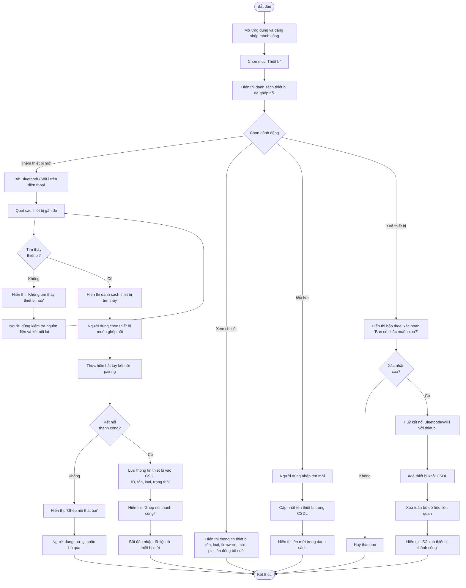
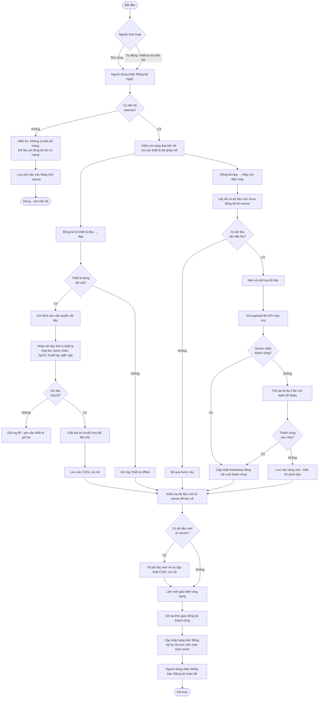
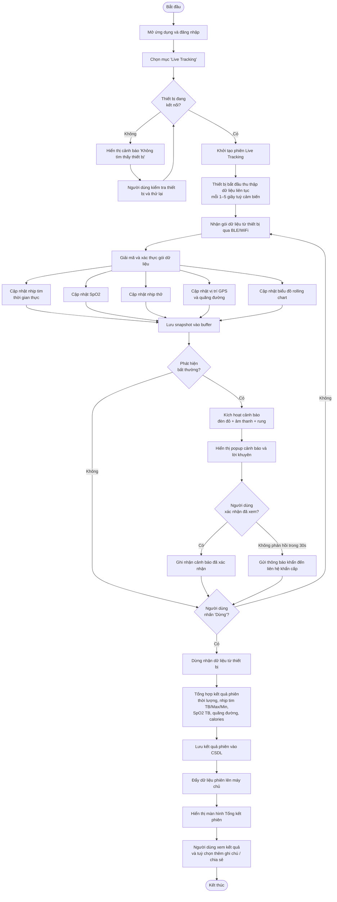
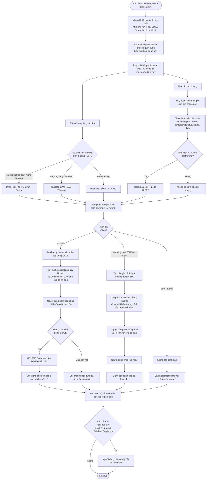

# Activity Diagrams – Ứng dụng theo dõi sức khỏe

Tài liệu này chứa **Activity Diagram** cho 4 usecase phân rã chính của ứng dụng theo dõi sức khỏe.

> **Ghi chú**: Các file `.puml` trong thư mục này có thể mở và render bằng [PlantUML](https://plantuml.com/), plugin PlantUML trong VS Code / IntelliJ, hoặc [PlantText online](https://www.planttext.com/).

---

## Danh sách Usecase

| # | Tên Usecase |
|---|-------------|
| 1 | Quản lí thiết bị |
| 2 | Đồng bộ dữ liệu |
| 3 | Live Tracking |
| 4 | Xử lí và cảnh báo rủi ro |

---

## 1 – Quản lí thiết bị

---

## 2 – Đồng bộ dữ liệu

---

## 3 – Live Tracking

---

## 4 – Xử lí và cảnh báo rủi ro

---

*Tài liệu: Activity Diagrams – Ứng dụng theo dõi sức khỏe*
