# Activity Diagrams - Ứng dụng theo dõi sức khỏe

Tài liệu này chứa **Activity Diagram** cho tất cả các **Usecase phân rã** trong ứng dụng theo dõi sức khỏe.

---

## Danh sách Usecase

| Mã | Tên Usecase |
|----|-------------|
| UC01 | Đăng ký tài khoản |
| UC02 | Đăng nhập hệ thống |
| UC03 | Quên mật khẩu |
| UC04 | Cập nhật thông tin cá nhân |
| UC05 | Ghi nhận chỉ số sức khỏe |
| UC06 | Theo dõi hoạt động thể chất |
| UC07 | Đặt mục tiêu sức khỏe |
| UC08 | Xem lịch sử sức khỏe |
| UC09 | Xem báo cáo thống kê |
| UC10 | Nhận thông báo nhắc nhở |
| UC11 | Quản lý lịch uống thuốc |
| UC12 | Chia sẻ dữ liệu với bác sĩ |

> **Lưu ý**: Các file `.puml` trong thư mục này có thể mở bằng [PlantUML](https://plantuml.com/) hoặc plugin PlantUML trong VS Code / IntelliJ để xem/chỉnh sửa diagram.

---

## UC01 – Đăng ký tài khoản

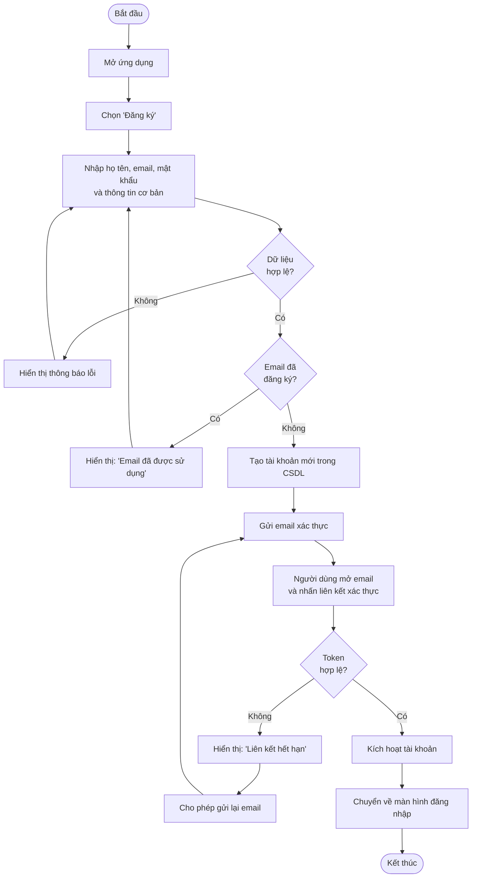

---

## UC02 – Đăng nhập hệ thống

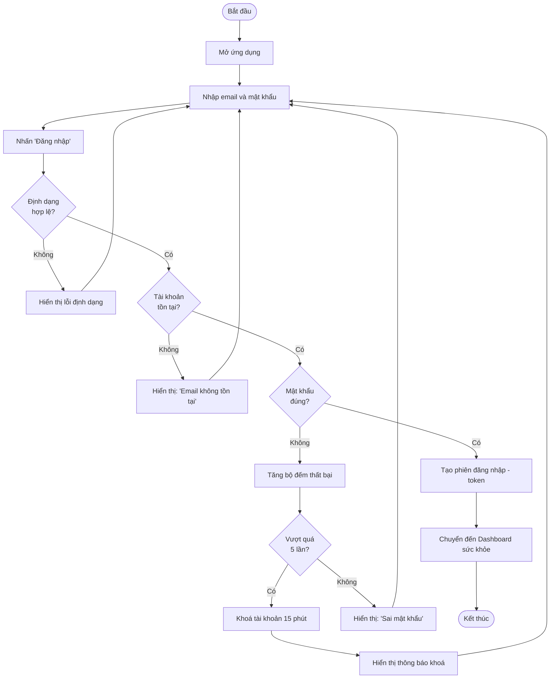

---

## UC03 – Quên mật khẩu

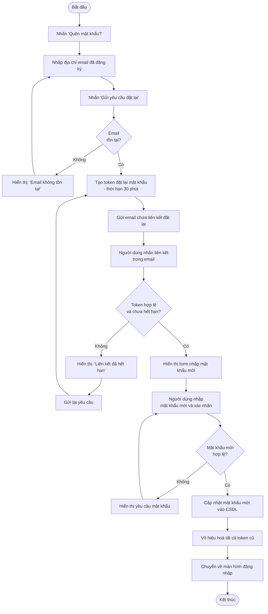

---

## UC04 – Cập nhật thông tin cá nhân

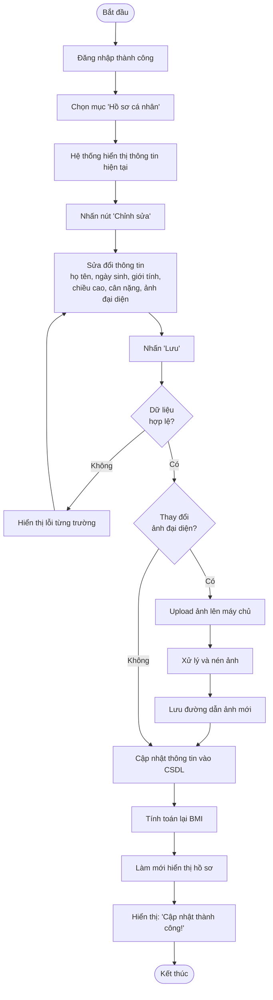

---

## UC05 – Ghi nhận chỉ số sức khỏe

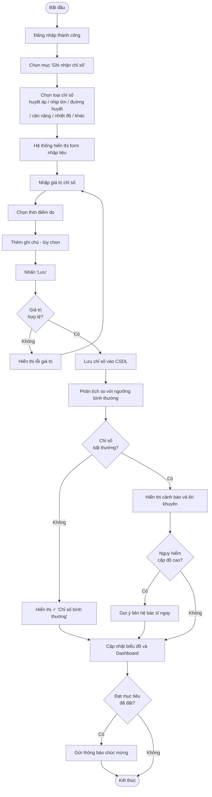

---

## UC06 – Theo dõi hoạt động thể chất

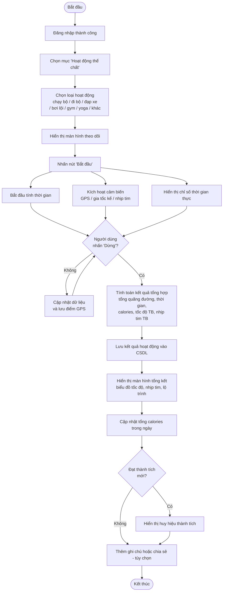

---

## UC07 – Đặt mục tiêu sức khỏe

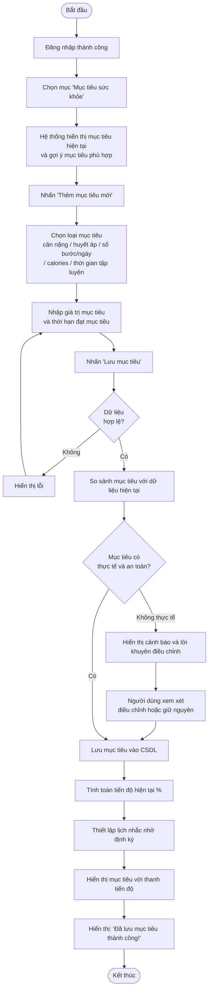

---

## UC08 – Xem lịch sử sức khỏe

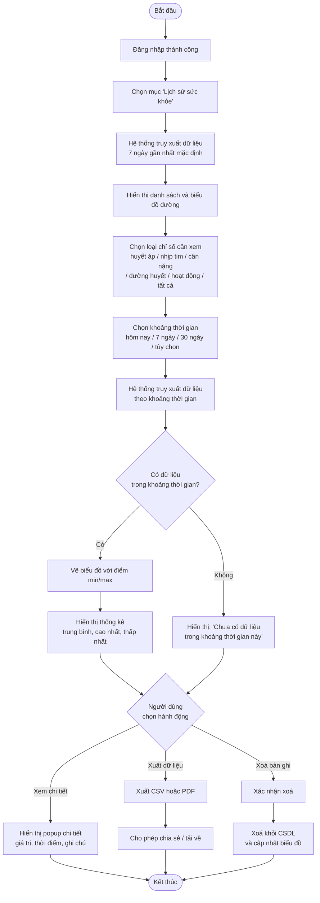

---

## UC09 – Xem báo cáo thống kê

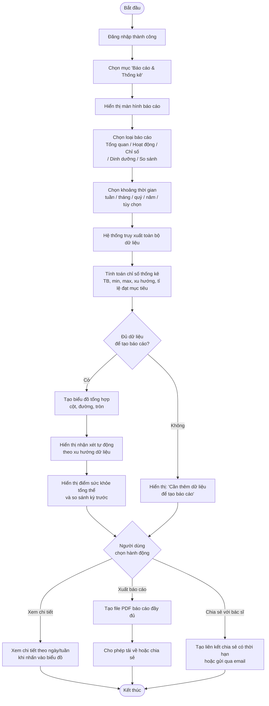

---

## UC10 – Nhận thông báo nhắc nhở

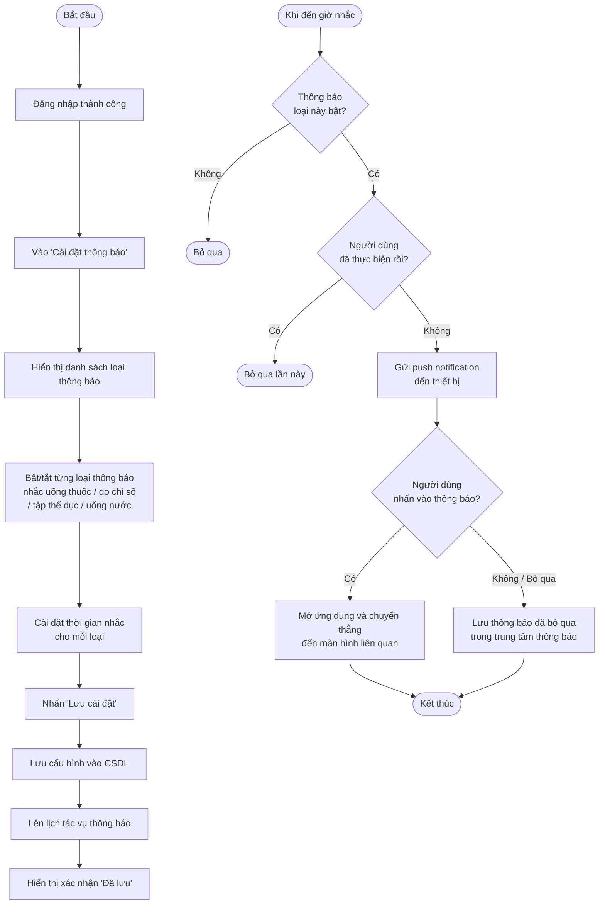

---

## UC11 – Quản lý lịch uống thuốc

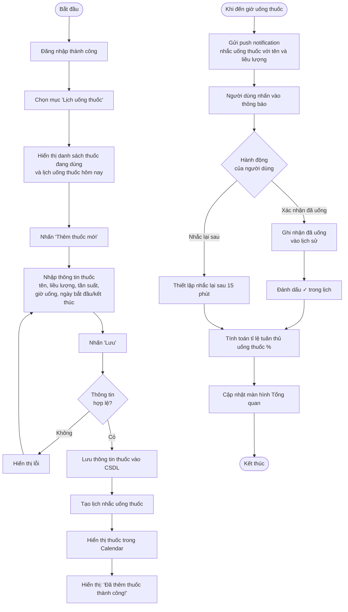

---

## UC12 – Chia sẻ dữ liệu với bác sĩ

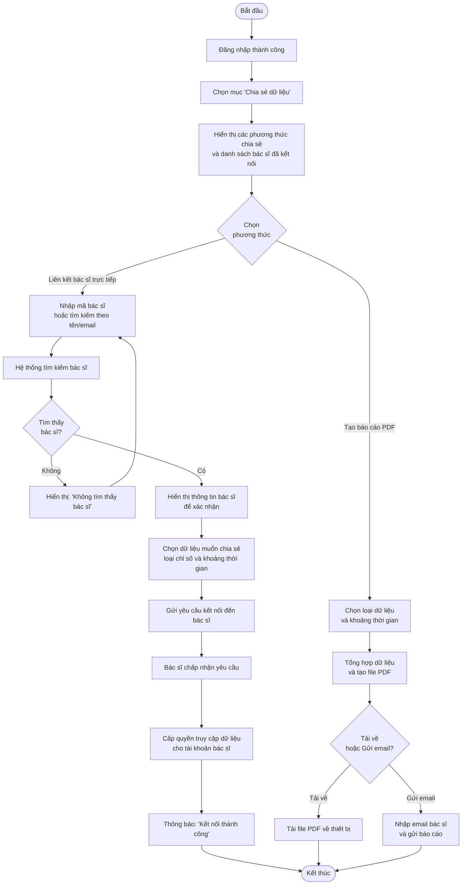

---

*Tài liệu được tạo bởi: Hoàng Nam & Thế Lộc*
